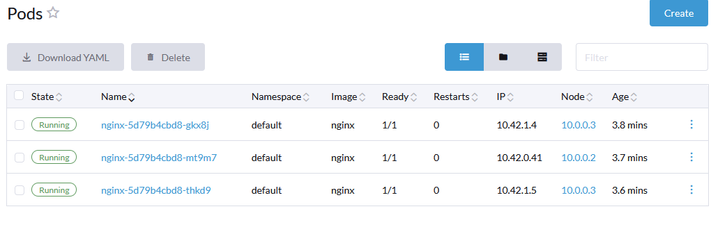

```
instance_internal_ips = [
  "10.0.0.3",
  "10.0.0.2",
]
instance_ips = [
  "34.45.189.254",
  "34.68.131.157",
]
```

# Single Node | RKE v1.6.1 | Rancher 2.9 | Kubernetes v1.29.7

```
ssh -i rancher-multinode/rancher-key.pem rancher@34.45.189.254
```


```
pastikan ssh ke semua server
sudo su
cat /home/serverdevops/cluster.yml
su serverdevops
cat /home/serverdevops/.ssh/id_rsa.pub
echo "ssh-rsa AAAAB3NzaC1yc2EAAAADAQABAAABAQCr9aVw7RfNmRfcnE99B+lhKqtsKJTPtshlen/gPh9Ph6Zdk5BKCgDz3A6X1eSlFiyFPwuu5pCiaBjddsqZbngAQ2LGWkYhAEkVdV5MD+YMWz9XMVkauEmAayTLC3PsPDbiL54QUF6/+ejEhXUHU6b5KxahC7K3QXf5Nb/FHPHCkj9rYDadbdfCj/wIzg4QDgfWKsrFyblW1J7bRniw/oXdTPqlKRGsn7rZ9d4mYNnTe2he11aKZwndPUGmEcWmPL8h+hmzwMhuZj+6ELZf9vGNIaee+5QdpgOI2DBnkKGOyopDWZZjSYKxjkoN3G2id2q9aLx6/Nv+fvS+IpK33g3h ansible-generated on rancher-node-1" >> ~/.ssh/authorized_keys
ssh serverdevops@10.0.0.3 # tes ssh
```

```
cd /home/serverdevops/
nano cluster.yml # sesuaikan IP
rke up --config cluster.yml
INFO[0176] Finished building Kubernetes cluster successfully
export KUBECONFIG=$HOME/kube_config_cluster.yml
kubectl get nodes
```

```
helm repo add rancher-latest https://releases.rancher.com/server-charts/latest
kubectl create namespace cattle-system
kubectl apply -f https://github.com/cert-manager/cert-manager/releases/download/v1.13.2/cert-manager.crds.yaml
helm repo add jetstack https://charts.jetstack.io
helm repo update
helm install cert-manager jetstack/cert-manager --namespace cert-manager --create-namespace --version v1.13.2
helm install rancher rancher-latest/rancher --namespace cattle-system --set hostname=ranchergcp.anakdevops.online
helm list --namespace cattle-system
kubectl -n cattle-system get deploy rancher
kubectl scale --replicas=1 deployment rancher -n cattle-system #scale down
kubectl -n cattle-system get deploy rancher -w
```


# Add Worker Node | RKE v1.6.1 | Rancher 2.9 | upgrade Kubernetes v1.29.7 to v1.30.3

```
instance_internal_ips = [
  "10.0.0.3",
  "10.0.0.2",
]
instance_ips = [
  "34.45.189.254",
  "34.68.131.157",
]
```

```
ssh -i rancher-multinode/rancher-key.pem rancher@34.68.131.157
sudo su
su serverdevops
cat /home/serverdevops/.ssh/id_rsa.pub
echo "ssh-rsa AAAAB3NzaC1yc2EAAAADAQABAAABAQDo+NHMbIOWnPZLB4hbJP31i/3Y/Y4K1Y3k6OmcK6JvnZ9nCF/P1ga7dW8WKlDXDQGueI3UipvbOQQa9bc2pcAb9Hfd8h2/w2GaK+jYGss/Ln+0UDHM236fSD3j3ksu8fEZQFeR1MFOZ0TJVl8+xYgz7DCVTA3cuxnUKShjk8ZYIuIaMxKbQuyypDHw08WwGACZWSWUYSpEAkt3d8JBsQO6G1lSN17omiQs5OzTBg1FXQku6KHWVAhcWkdsNlCe5mCPgYQTMLvdGV+vnY132Ho7pC7dc4vcCeOG5FYx/wr8i5kbT2F6OdoAK2DdA+/mDjWJcu08UF2Q/eZUSm7LmjIx ansible-generated on rancher-node-2" >> ~/.ssh/authorized_keys
ssh serverdevops@10.0.0.3 # node 1
ssh serverdevops@10.0.0.2 # node 2
rke config --list-version --all #cek kubernetes version
cd /home/serverdevops/
nano cluster.yml #Add IP Node 2
cat cluster.yml
rke up --config cluster.yml 
```


